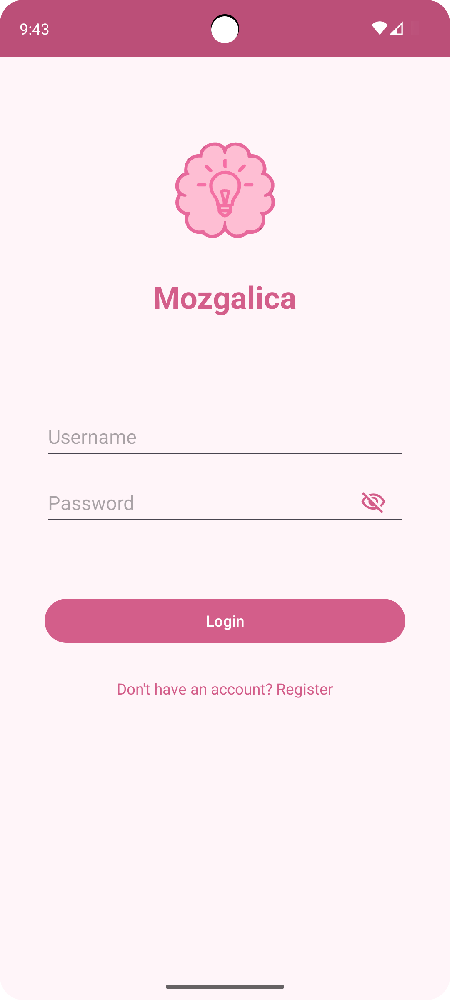
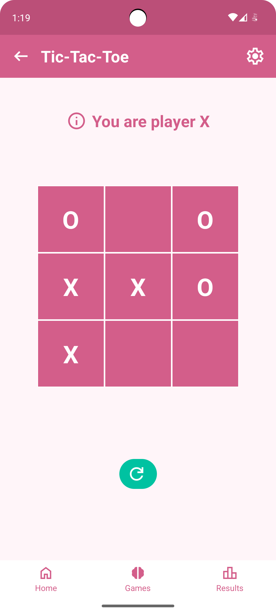
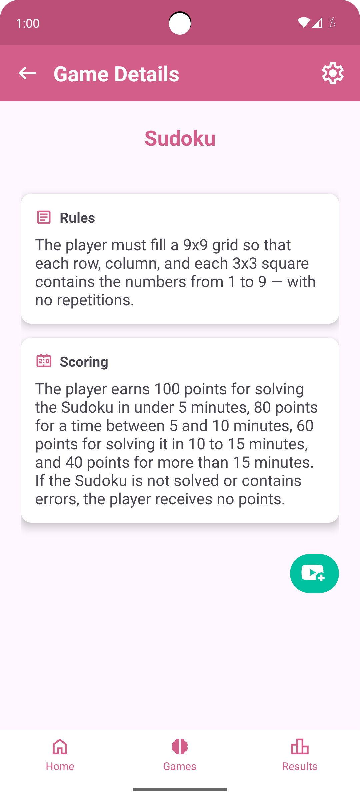
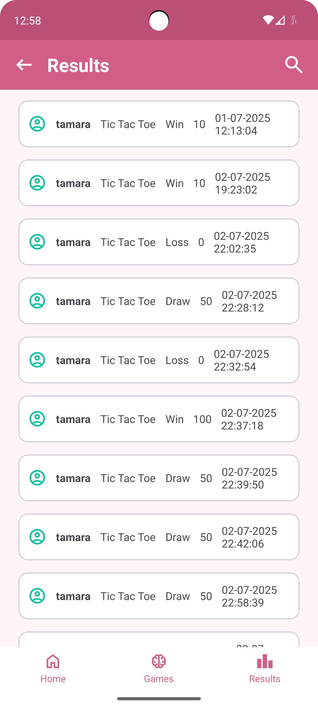

# 🧠 Mozgalica

**Mozgalica** is a university project – an Android application written in Java that features a collection of three logic games, including Tic Tac Toe, Memory Match, and Sudoku. The application allows users to play under a unique username and stores their results locally using an SQLite database. It supports result history search based on multiple criteria such as username, game name, result, and score, and offers detailed rules and video tutorials for each game. The app includes a simple, modern interface with support for both Serbian and English languages, responsive layout for various screen sizes, and asynchronous operations to ensure a smooth user experience.

## 📑 Content
- Register, login page and home
- Game pages
- Results page
- Settings page

## 🏠 Register, login and home page
Allows users to create an account and log in using a unique username. This step is required to access the games and use the application. After logging in, users are redirected to the main menu where they can choose a game, view results, or change settings.

 

 

 

## 🎮 Game pages
Users can view all available games in one place. From the list, they can select one of the three offered games to either read the game description and rules or start playing.

 

 Each game includes its own interface, scoring logic, and a link to a related YouTube video tutorial. The games are:

 - Tic-Tac-Toe

   

   
  
 - Memory match

   

   

  - Sudoku

   

   

## 📊 Results page
Displays a history of all game results with the ability to search by username, game name, result, or score.

  

  

## ⚙️ Settings page
Allows users to switch the application language (Serbian or English) and log out. All language changes are applied immediately throughout the entire app.

 

## 📄 Reference to the detailed description
Detailed description of the project can be found in the folder "Description".